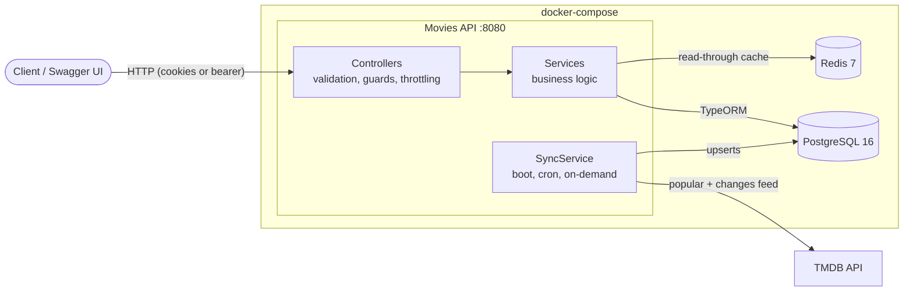
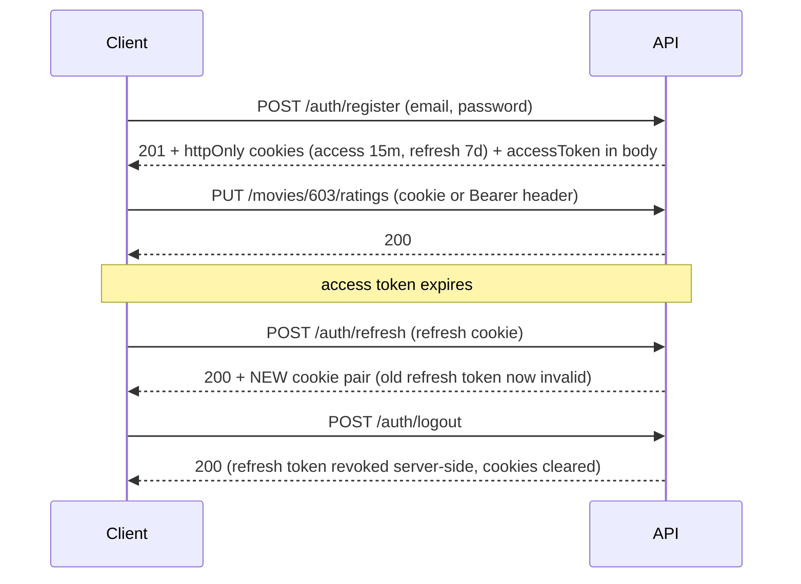
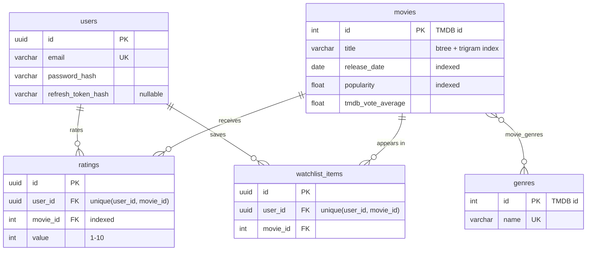

# Movies API

[](https://github.com/IbrahimHafez1/kib-movies-api/actions/workflows/ci.yml)


A production-ready RESTful API built with **NestJS** that syncs movie data from [TMDB](https://www.themoviedb.org/) into PostgreSQL and lets users browse, search, rate and watchlist movies. Reads are cached in Redis, writes are protected with JWT auth delivered via httpOnly cookies.

## Table of Contents

- [Features](#features)
- [Tech Stack](#tech-stack)
- [Architecture](#architecture)
- [Quick Start](#quick-start)
- [API Overview](#api-overview)
- [Authentication Flow](#authentication-flow)
- [Data Model](#data-model)
- [TMDB Sync Strategy](#tmdb-sync-strategy)
- [Project Structure](#project-structure)
- [Design Decisions](#design-decisions)
- [Trade-offs](#trade-offs-made-consciously)
- [Configuration](#configuration)
- [Scripts](#scripts)
- [Testing](#testing)
- [Database Migrations](#database-migrations)
- [Troubleshooting](#troubleshooting)

## Features

- **TMDB sync** — genres and popular movies are upserted on first boot, daily (cron), or on demand via `POST /sync`. An incremental job additionally polls TMDB's changes feed every 6 hours and refreshes only tracked movies that actually changed. Syncs are idempotent, so re-runs and future data additions are safe.
- **Browse movies** — pagination, title search, genre filtering (by name or TMDB id), sorting by popularity, release date, title or average user rating.
- **Ratings** — authenticated users rate movies 1–10 (create/update/delete); every movie response includes the live average rating and rating count.
- **Watchlist** — add/remove/list movies per user.
- **Caching** — Redis-backed read cache with O(1) namespace invalidation when ratings or syncs change the data.
- **Auth** — JWT access tokens (15 min) + rotating refresh tokens (7 days), both as httpOnly cookies; `Authorization: Bearer` is also accepted for non-browser clients. Refresh tokens are stored hashed and revoked on logout.
- **Hardening** — rate limiting, helmet security headers, strict input validation, race-safe writes, TMDB retries with backoff, non-root Docker runtime.

## Tech Stack

| Layer      | Choice                                  |
| ---------- | --------------------------------------- |
| Runtime    | Node.js 22, NestJS 10, TypeScript       |
| Database   | PostgreSQL 16 + TypeORM (migrations)    |
| Cache      | Redis 7 via cache-manager               |
| Auth       | Passport JWT, bcryptjs, httpOnly cookies|
| Docs       | OpenAPI / Swagger UI                    |
| Tests      | Jest unit tests (>85% coverage enforced) + supertest e2e |
| CI         | GitHub Actions (lint, tests, e2e, image build) |
| Packaging  | Docker multi-stage build, docker-compose|

## Architecture



Requests hit controllers (validation, auth guards, rate limiting), which delegate to services. Read endpoints go through the Redis cache before touching PostgreSQL; rating writes and syncs invalidate affected cache entries. The sync pipeline is the only component that talks to TMDB.

## Quick Start

Prerequisites: Docker with the Compose plugin. Nothing else needs to be installed.

```bash
# 1. (Optional but recommended) provide a TMDB credential so the database self-populates.
#    Either the v3 "API Key" or the "API Read Access Token" works - it is auto-detected.
echo "TMDB_API_KEY=<your key or token>" > .env

# 2. Build and run everything
docker-compose up
```

The API is now available at **http://localhost:8080** and the interactive Swagger documentation at **http://localhost:8080/docs**.

On first boot the app runs database migrations and, if a TMDB credential is configured, syncs genres plus `TMDB_SYNC_PAGES` pages of popular movies (default 5 pages ≈ 100 movies). Without a credential the app still runs; trigger a sync later with `POST /sync` once it is set.

### Local development (without Docker for the app)

```bash
npm install
docker compose -f docker-compose.yml -f docker-compose.dev.yml up -d db redis
cp .env.example .env   # set DB_PORT=55432, REDIS_PORT=56379 to match the dev override
npm run start:dev
```

## API Overview

Full request/response schemas live in Swagger (`/docs`). Endpoints marked 🔒 require authentication.

| Method | Path | Description |
| ------ | ---- | ----------- |
| GET | `/movies` | List movies — `page`, `limit`, `search`, `genre` (name or id), `sortBy` (`popularity`,`releaseDate`,`title`,`averageRating`), `order`. Includes average user rating per movie. |
| GET | `/movies/:id` | Movie details with genres and rating stats |
| GET | `/genres` | List all genres |
| PUT 🔒 | `/movies/:id/ratings` | Rate a movie 1–10 (creates or updates your rating) |
| DELETE 🔒 | `/movies/:id/ratings` | Remove your rating |
| GET 🔒 | `/watchlist` | Your watchlist (paginated) |
| POST 🔒 | `/watchlist/:movieId` | Add a movie to your watchlist |
| DELETE 🔒 | `/watchlist/:movieId` | Remove a movie from your watchlist |
| POST | `/auth/register` | Create an account (sets auth cookies) |
| POST | `/auth/login` | Log in (sets auth cookies) |
| POST | `/auth/refresh` | Rotate the refresh token, issue a new access token |
| POST 🔒 | `/auth/logout` | Revoke the refresh token, clear cookies |
| POST 🔒 | `/sync` | Trigger a TMDB sync on demand |
| GET | `/health` | Liveness + database/cache connectivity (used by the Docker healthcheck) |

Example session:

```bash
# Register and capture cookies
curl -c jar.txt -X POST http://localhost:8080/auth/register \
  -H "Content-Type: application/json" \
  -d '{"email":"jane@example.com","password":"S3cure-password"}'

# Rate a movie using the httpOnly cookie
curl -b jar.txt -X PUT http://localhost:8080/movies/603/ratings \
  -H "Content-Type: application/json" -d '{"value":9}'

# Browse action movies sorted by user rating
curl "http://localhost:8080/movies?genre=Action&sortBy=averageRating&order=DESC"
```

Sample `GET /movies` response:

```json
{
  "data": [
    {
      "id": 603,
      "title": "The Matrix",
      "originalTitle": "The Matrix",
      "overview": "A hacker discovers that reality is a simulation.",
      "releaseDate": "1999-03-31",
      "posterPath": "/p96dm7sCMn4VYAStA6siNz30G1r.jpg",
      "backdropPath": "/icmmfXiqwiryeg1mD3YgSQ4dGm6.jpg",
      "originalLanguage": "en",
      "popularity": 85.5,
      "tmdbVoteAverage": 8.2,
      "tmdbVoteCount": 26512,
      "genres": [{ "id": 28, "name": "Action" }, { "id": 53, "name": "Thriller" }],
      "averageRating": 8.5,
      "ratingCount": 2
    }
  ],
  "meta": { "page": 1, "limit": 20, "totalItems": 100, "totalPages": 5, "hasNextPage": true }
}
```

Errors use a consistent envelope — validation failures list one message per violated rule:

```json
{ "message": ["value must not be greater than 10"], "error": "Bad Request", "statusCode": 400 }
```

## Authentication Flow



- Tokens live in **httpOnly cookies**, so page scripts can never read them (XSS-safe); `SameSite=Lax` blunts CSRF, and the refresh cookie is scoped to `/auth` only.
- **Refresh tokens rotate**: each one works exactly once, carries a unique `jti`, and only its SHA-256 hash is stored — a leaked database exposes nothing replayable.
- Non-browser clients can ignore cookies entirely and send `Authorization: Bearer <accessToken>`.

## Data Model



Indexes follow the queries: a **trigram (pg_trgm) GIN index** keeps `ILIKE '%term%'` title search fast at scale, btree indexes back the popularity/release-date/title sort orders, `ratings.movie_id` accelerates the average-rating aggregation, and composite unique constraints double as lookup indexes for per-user queries.

## TMDB Sync Strategy

TMDB offers **no webhooks** — its [change tracking docs](https://developer.themoviedb.org/docs/tracking-content-changes) recommend polling the changes feed, which is exactly what this service does:

| Job | When | What it does |
| --- | ---- | ------------ |
| Initial seed | First boot (empty DB) | Genres + `TMDB_SYNC_PAGES` pages of popular movies |
| Full sync | Daily 03:00 + `POST /sync` | Re-syncs genres and the popular set; refreshes membership |
| Incremental sync | Every 6 hours | Polls `/movie/changes`, intersects with tracked movies, refreshes only real changes |

All paths are **idempotent upserts** keyed on TMDB ids, so concurrent or repeated runs converge instead of duplicating. TMDB calls retry transient failures (network, 5xx, 429) with exponential backoff — but never client errors, because retrying a bad API key cannot succeed. Successful syncs invalidate the read caches. If TMDB ever ships webhooks, `SyncService` is the single integration point.

## Project Structure

```
.github/workflows/  # CI: lint, unit + e2e tests against real services, image build
src/
├── auth/        # register/login/refresh/logout, JWT strategy & guard, cookies
├── cache/       # Redis cache facade (getOrSet + namespace version invalidation)
├── common/      # shared DTOs (pagination), decorators, db error helpers
├── config/      # typed configuration + env validation
├── database/    # TypeORM setup, CLI data source, migrations
├── genres/      # genre entity + listing endpoint
├── health/      # liveness endpoint covering Postgres and Redis
├── movies/      # movie listing/search/filter/sort with rating aggregation
├── ratings/     # rate/unrate endpoints (upsert semantics)
├── sync/        # TMDB -> DB sync (bootstrap, cron, manual trigger)
├── tmdb/        # typed TMDB API client with retry/backoff
├── users/       # user persistence
└── watchlist/   # per-user watchlist endpoints
test/            # end-to-end suite exercising real HTTP, Postgres and Redis
```

Each module owns its entities, DTOs, service and controller. Cross-module access goes through exported services (e.g. ratings invalidate movie caches through `MoviesService`), keeping boundaries explicit and the modules independently testable.

## Design Decisions

- **TMDB ids as primary keys** for movies/genres make the sync a plain upsert — no id mapping tables, and re-syncs converge instead of duplicating. Adding more TMDB resources (top-rated, now-playing, TV) is a matter of new fetcher + the same upsert.
- **Polling, because TMDB has no webhooks.** The incremental sync polls TMDB's changes feed, intersects it with locally tracked movies and refreshes only the matches — near-realtime freshness at the cost of a handful of id-only requests, instead of re-downloading whole catalogs.
- **Average rating in SQL, not application code.** The list endpoint aggregates ratings with a grouped query (and sorts by rating through a subquery), so the work happens where the indexes are.
- **Cache invalidation by namespace version.** List responses are cached under `movies:list:v{N}:{query}`; a rating write or sync bumps `N` once instead of hunting down every cached query permutation. Movie detail keys are deleted directly.
- **Indexes where queries actually go**: trigram (pg_trgm) GIN index for `ILIKE` title search, btree indexes on popularity/release date/title for sorting, FK indexes on ratings and the genre join table.
- **Refresh token rotation** with SHA-256 hashed storage and per-token `jti`: a stolen refresh token works at most once, and tokens never sit in localStorage thanks to httpOnly cookies.
- **Migrations over `synchronize`** — the schema is versioned and applied automatically on startup, which is safe to ship.
- **The database is the arbiter for races.** Existence pre-checks give friendly errors for the common case, but concurrent writes (same rating, watchlist entry or email registered twice at once) are resolved by unique constraints and translated into proper 409/404 responses instead of 500s.

## Trade-offs (made consciously)

- **One refresh token per user**: logging in on a second device invalidates the first device's refresh token. Multi-session support would move refresh tokens into their own table; out of scope here.
- **Any authenticated user can trigger `/sync`**: it is idempotent and rate-limited, so the blast radius is a few TMDB calls. A role system (admin-only sync) is the natural next step.
- **Movies are read-only by design**: TMDB is the source of truth and the sync would overwrite manual edits. User-generated state lives in ratings and watchlists, which have full create/update/delete.

## Configuration

All settings come from environment variables (see `.env.example`):

| Variable | Default | Description |
| -------- | ------- | ----------- |
| `PORT` | `8080` | HTTP port |
| `DB_HOST` / `DB_PORT` / `DB_USERNAME` / `DB_PASSWORD` / `DB_NAME` | `localhost` / `5432` / `postgres` / `postgres` / `movies` | PostgreSQL connection |
| `REDIS_HOST` / `REDIS_PORT` | `localhost` / `6379` | Redis connection |
| `CORS_ORIGIN` | _(empty)_ | Comma-separated allowed origins; credentials (cookies) are shared only with these. Empty reflects any origin without credentials |
| `CACHE_TTL_MS` | `60000` | TTL for cached read responses |
| `TMDB_API_KEY` | _(empty)_ | Either the TMDB v3 "API Key" or the JWT "API Read Access Token" — the client auto-detects which and authenticates per TMDB's docs. Sync is skipped (with a warning) when unset |
| `TMDB_BASE_URL` | `https://api.themoviedb.org/3` | TMDB API base URL |
| `TMDB_SYNC_PAGES` | `5` | Popular-movie pages to sync (20 movies per page) |
| `JWT_ACCESS_SECRET` / `JWT_REFRESH_SECRET` | dev defaults | Token signing secrets — **required** in production; the app refuses to boot if the defaults are left in place |
| `JWT_ACCESS_EXPIRES_IN` / `JWT_REFRESH_EXPIRES_IN` | `15m` / `7d` | Token lifetimes |

## Scripts

| Script | Purpose |
| ------ | ------- |
| `npm run start:dev` | Run with hot reload (needs the dev db/redis, see Quick Start) |
| `npm run build` / `npm run start:prod` | Compile and run the production build |
| `npm test` / `npm run test:watch` | Unit tests |
| `npm run test:cov` | Unit tests + coverage report; **fails below 85% on any metric** |
| `npm run test:e2e` | End-to-end suite (needs the dev db/redis running) |
| `npm run lint` / `npm run lint:check` | ESLint + Prettier (with / without autofix) |
| `npm run migration:generate -- src/database/migrations/Name` | Generate a migration from entity changes |
| `npm run migration:run` / `npm run migration:revert` | Apply / roll back migrations manually |

## Testing

```bash
npm test          # unit tests
npm run test:cov  # with coverage (fails below 85% on any metric)

# e2e: spins nothing up itself - start the dev database/cache first
docker compose -f docker-compose.yml -f docker-compose.dev.yml up -d db redis
npm run test:e2e
```

Unit tests cover services, controllers, guards, the TMDB client, sync logic, cache behaviour and edge cases (invalid input, missing resources, duplicate entries, revoked refresh tokens, concurrent-write races). Current coverage is ~98% statements.

The e2e suite boots the full application against real Postgres and Redis in a dedicated `movies_e2e` database and exercises the actual HTTP contract: cookie + bearer auth, refresh rotation (replaying a rotated token fails), cache invalidation after rating writes, cross-user rating averages, watchlist privacy and validation errors.

Both suites run in CI on every push and pull request, alongside lint and a production image build (`.github/workflows/ci.yml`).

## Database Migrations

Migrations run automatically on startup. For manual control:

```bash
npm run migration:generate -- src/database/migrations/MyChange
npm run migration:run
npm run migration:revert
```

## Troubleshooting

| Symptom | Fix |
| ------- | --- |
| `port is already allocated` on 8080 | Stop whatever uses the port, or change the published port in `docker-compose.yml` (`"8081:8080"`) |
| `GET /movies` returns an empty list | No TMDB credential at first boot. Add `TMDB_API_KEY` to `.env`, restart (`docker compose up -d`), or register a user and call `POST /sync` |
| e2e tests fail with `ECONNREFUSED` | Start the dev services first: `docker compose -f docker-compose.yml -f docker-compose.dev.yml up -d db redis` |
| Want a completely fresh database | `docker compose down -v && docker compose up` (the `-v` drops the Postgres volume) |
| Sync logs `TMDB request failed (status: 401)` | The TMDB credential is wrong/expired — regenerate it at themoviedb.org → Settings → API |
